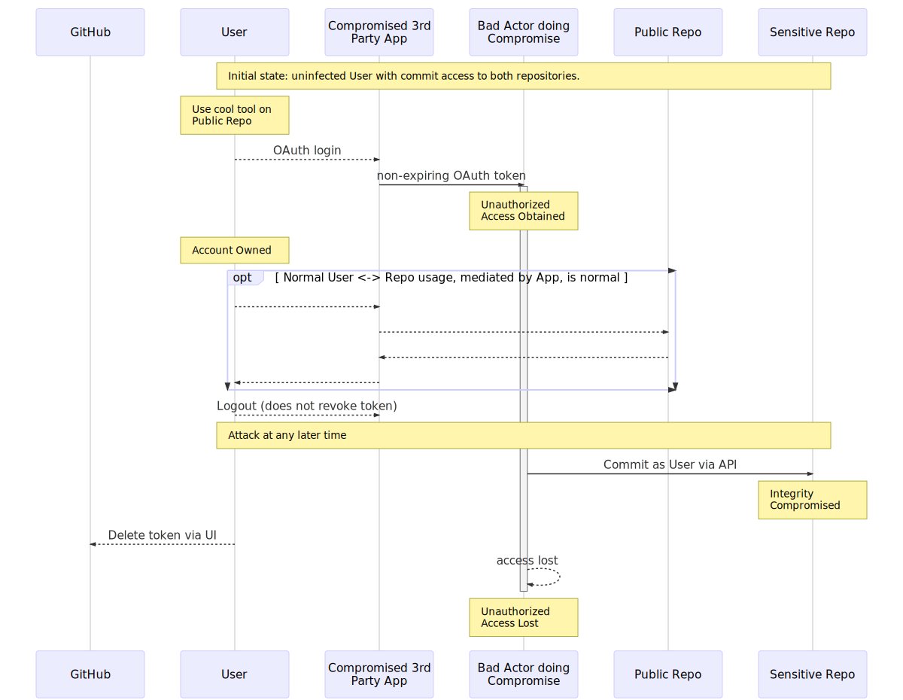
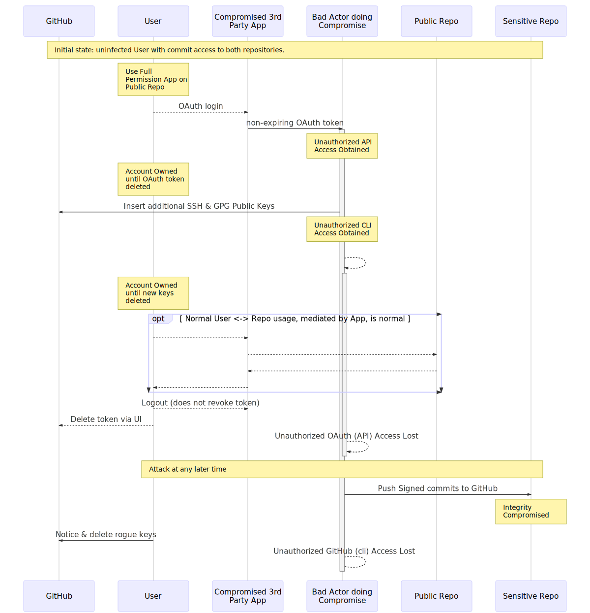

# Threat 1
Obtain rights to commit in user's name. (This also provide read access
to any private repositories the User can view.)

Almost all 3rd party apps are going to request, and need, "repo access"
to be able to act on behalf of the User.

Countermeasures:

- Require all commits to be GPG Signed.

# Threat 2
Obtain rights to issue verified commits in user's name. There are some
3rd Party Apps which request complete control over the User's GitHub
account. For examples, apps which offer a complete client for all Git &
GitHub actions. [SourceTreeForMac](https://www.sourcetreeapp.com/) is
one such app, which is approved for the Mozilla organization on GitHub.

Countermeasures:

- Verify that all signatures come from the correct key.[[1](#1)]

## Footnotes

1.  This process could be automated, and be a required
  status check to merge or release. There is additional administrative
  overhead in adding folks to the include list.
